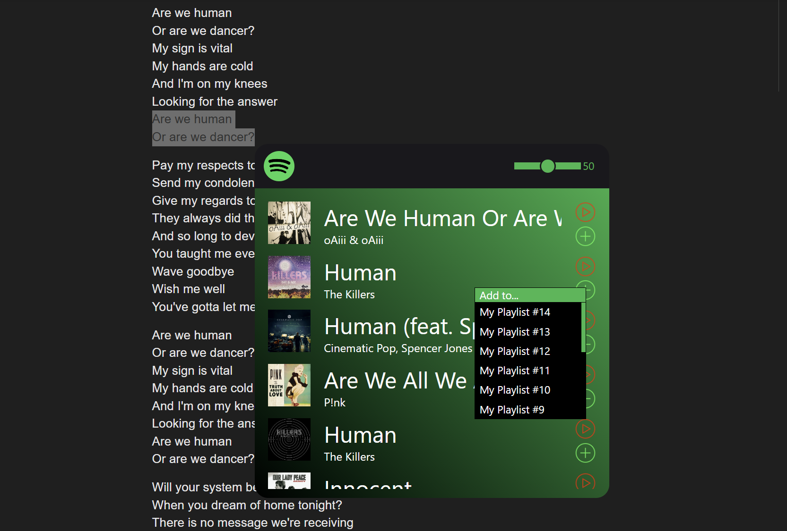

Find on Spotify is a Chromium extension in development that makes discovering music effortless. Highlight any text in your browser, click the extension button, and instantly search for the track on Spotify. From the popup, you can preview songs or add them directly to your playlists without leaving the page.

**Unfortunately, as part of the Spotify API changes announced on Nov. 27, 2024, the preview song feature is no longer available. Although potential solutions exist, they largely require the use of other services. At this time I see no reason to continue development of this extension. Song search remains functional, and you can still choose to add tracks to your playlists.**

